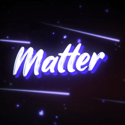

 
 

<!-- ![Badge Workflow] -->
[![Badge License]][License]
![Badge Language]
[![Badge Pull Requests]][Pull Requests]
[![Badge Issues]][Issues] 

 

Matter is a free, open-source and all-in-one ticket bot for Discord. With its modern and easy-to-use interface, you can easily create tickets, manage your support team and provide the best support to your users. Matter is highly customizable, allowing you to tailor it to your needs. It is also very lightweight, making it perfect for small and big servers alike.

Matter is the perfect ticket bot for any Discord server, offering a wide range of features and customization options. It is also very lightweight and easy to use, making it perfect for small and big servers alike.
 
 

---

<!-- **[<kbd>   Install   </kbd>][Install]**
**[<kbd>   Quick Start   </kbd>][Quick Start]**
**[<kbd>   Configure   </kbd>][Configure]**
**[<kbd>   Contribute   </kbd>][Contribute]** -->

---

 

# Features

- A modern and easy-to-use interface
- Highly customizable
- Support for multiple languages
- Ability to create and manage tickets
- Ability to manage your support team
- Ability to provide the best support to your users
- Highly scalable and can be used on small and big servers alike
- Very lightweight and won't slow down your server
- Easy to install and set up
- and much more...

 
 

<!-- # Special Thanks

 

**[wlroots]** - *For powering Matter in the past*

**[tinywl]** - *For showing how 2 do stuff*

**[Sway]** - *For showing how 2 do stuff the overkill way*

**[Vivarium]** - *For showing how 2 do stuff the simple way*

**[dwl]** - *For showing how 2 do stuff the hacky way*

**[Wayfire]** - *For showing how 2 do some graphics stuff* -->

<!----------------------------------------------------------------------------->

<!-- [Configure]: https://wiki.Matter.org/Configuring/Configuring-Matter/ -->

[Pull Requests]: https://github.com/kaeeraa/Matter/pulls
[Issues]: https://github.com/kaeeraa/Matter/issues

<!-- [Contribute]: https://wiki.Matter.org/Contributing-and-Debugging/
[Install]: https://wiki.Matter.org/Getting-Started/Installation/
[Quick Start]: https://wiki.Matter.org/Getting-Started/Master-Tutorial/ -->
[License]: LICENSE

<!----------------------------------{ Thanks }--------------------------------->

<!-- [Vivarium]: https://github.com/inclement/vivarium
[WlRoots]: https://gitlab.freedesktop.org/wlroots/wlroots
[Wayfire]: https://github.com/WayfireWM/wayfire
[TinyWl]: https://gitlab.freedesktop.org/wlroots/wlroots/-/blob/master/tinywl/tinywl.c
[Sway]: https://github.com/swaywm/sway
[DWL]: https://codeberg.org/dwl/dwl -->

<!----------------------------------{ Images }--------------------------------->

<!-- [Preview A]: https://i.ibb.co/C1yTb0r/falf.png
[Preview B]: https://linfindel.github.io/cdn/Matter-preview-b.png
[Preview C]: https://i.ibb.co/B3GJg28/20221126-20h53m26s-grim.png -->

<!----------------------------------{ Badges }--------------------------------->

<!-- [Badge Workflow]: https://github.com/kaeeraa/Matter/actions/workflows/ci.yaml/badge.svg -->

[Badge Issues]: https://img.shields.io/github/issues/kaeeraa/Matter
[Badge Pull Requests]: https://img.shields.io/github/issues-pr/kaeeraa/Matter
[Badge Language]: https://img.shields.io/github/languages/top/kaeeraa/Matter
[Badge License]: https://img.shields.io/github/license/kaeeraa/Matter

<!-- actually stoled readme from https://github.com/kaeeraa/Matter , thanks u  -->